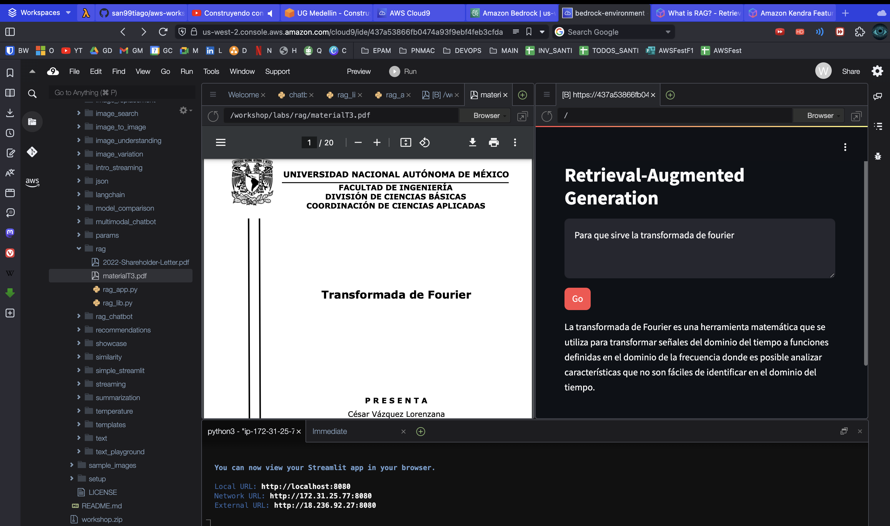
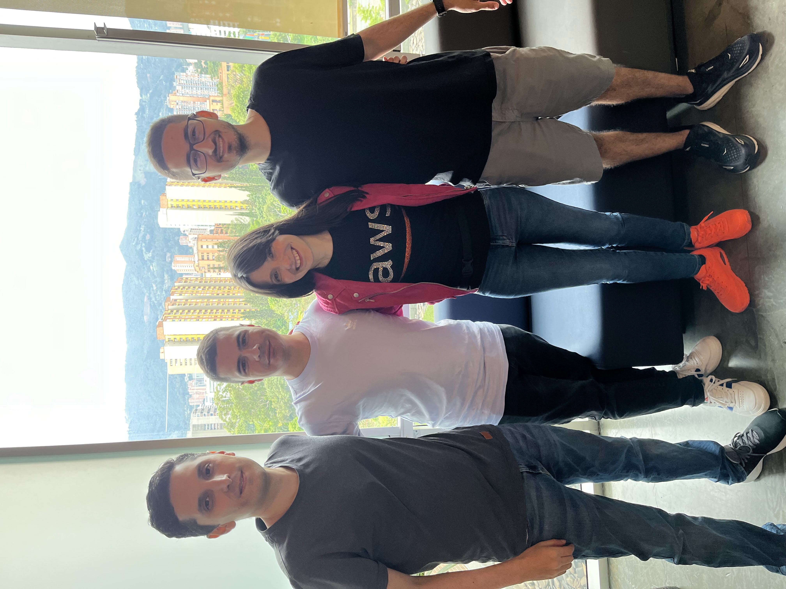
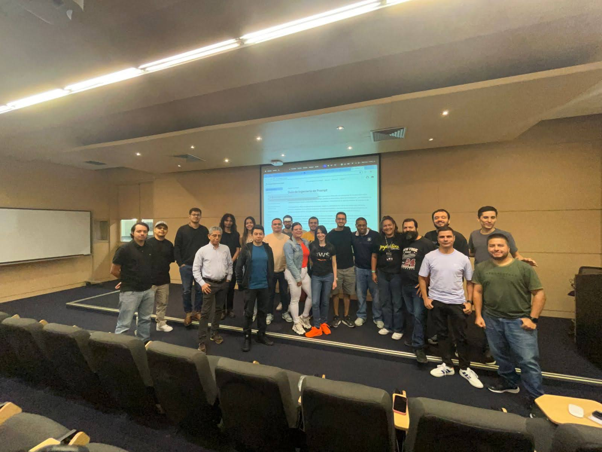
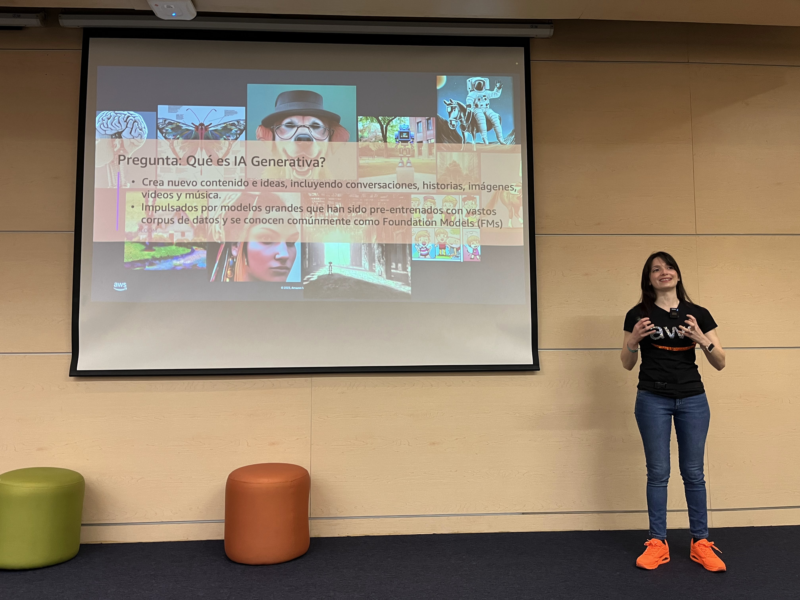

# GENERAL WORKSHOP OF AI MULTIMODAL SOLUTIONS WITH AWS

## AWS User Group Medellin (2024-06-07)

Recording:

- [Construyendo con generative AI: aprende cómo crear aplicaciones multimodales](https://youtu.be/wGwFfCvBwFQ)

Official AWS Workshop:

- https://catalog.workshops.aws/building-with-amazon-bedrock/en-US

 

 

This is just some of the sample code used during the workshop. All of it is inspired/developed by other open source projects.

## Special Thanks

Elizabeth Fuentes: @elizabethfuentes12

- For driving this workshop and sharing your knowledge/experience with us.
